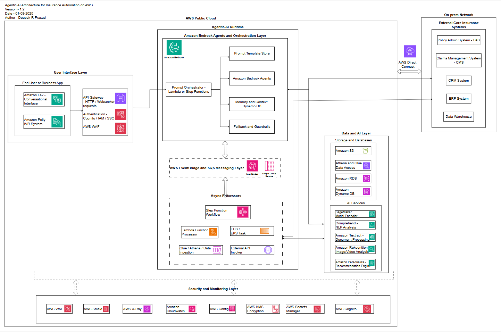
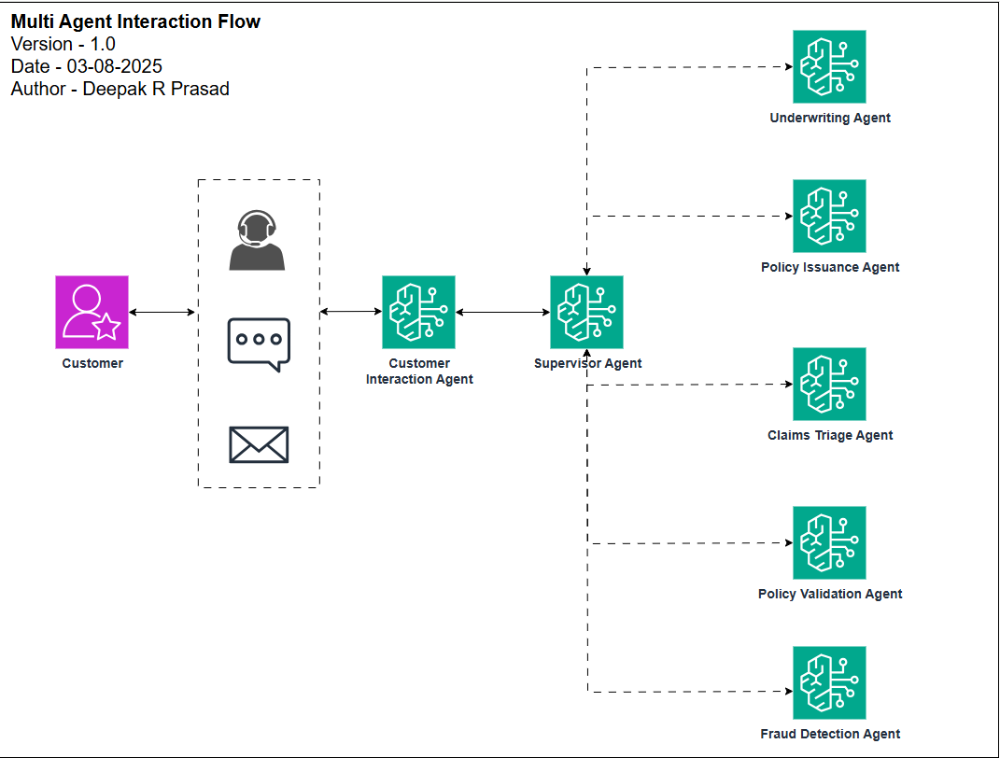

  

# 🤖 Agentic AI Framework for Insurance – Architecture & Design Diagrams

This repository contains a collection of architecture and design diagrams for implementing **Agentic AI** in the **insurance domain** using **Amazon Bedrock** and supporting AWS services.

These diagrams are intended to guide technical teams, solution architects, and AI/ML strategists in designing scalable, secure, and explainable agentic workflows that integrate with existing enterprise systems.

---

## 📌 What’s Included

### 1. High-Level Architecture Diagram

A layered view of the proposed Agentic AI solution stack:

* **User Interface Layer**: Web portals, chatbots, call center UIs
* **Agentic AI Runtime**: Amazon Bedrock with Bedrock Agents
* **Messaging Backbone**: EventBridge and Amazon SQS
* **Asynchronous Processors**: AWS Lambda, Step Functions, and containerized workers
* **Data & AI Layer**: S3, OpenSearch, Kendra, DynamoDB, and optionally SageMaker
* **Enterprise System Integration**: Core systems like PAS, CRM, CMS, ERP
* **Security & Monitoring**: IAM, CloudTrail, GuardDuty, CloudWatch, Config

---

### 2. Multi-Agent Interaction Diagram

A high-level workflow diagram that visualizes how user interactions are routed and handled in the Agentic AI ecosystem.

Entry Points: Users initiate requests via phone calls, chatbots, or service portals (e.g., ticketing systems).

Customer Interaction Agent

Supervisor Agent

Underwriting Agent 

Policy Issuance Agent

Claims Triage Agent

Policy Validation Agent

Fraud Detection Agent

This diagram helps convey the overall orchestration and routing logic, not internal workflows or HITL delegation.

---

### 3. Agent-Level Design Diagrams

Each agent has its own dedicated design diagram showing internal subflows and AWS service interactions:

* **🟨 Customer Interaction Agent**
* **🟫 Supervisor Agent**
* **🟩 Underwriting Agent**
* **🟦 Policy Issuance Agent**
* **🟪 Claims Triage Agent**
* **🟥 Policy Validation Agent**
* **🟧 Fraud Detection Agent**

## 🧠 Key Agent Responsibilities & Design Diagrams

Each agent below has a dedicated diagram (see `/assets` folder) showing internal subflows and AWS service interactions.

---

### 🟨 **1. Customer Interaction Agent**
**Role:** First point of contact via chat or voice  
**Responsibilities:**
- Captures user intent, authenticates identity  
- Converts customer queries into structured agent tasks  
- Delivers responses, updates, and notifications  
**Interactions:**
- Frontend via **Amazon Lex** or **WebSocket-based UI**  
- Sends structured input to Supervisor Agent  
- Fetches outcomes from downstream agents  
📎 *See: `3.4_Customer_Interaction_Agent.svg`*

---

### 🟫 **2. Supervisor Agent**
**Role:** Orchestrates and monitors multi-agent workflows  
**Responsibilities:**
- Delegates tasks to specialized agents (e.g., Underwriting, Claims, Policy Issuance)  
- Manages escalations and HITL (Human-in-the-Loop)  
- Maintains execution context, traceability, and audit logs  
**Interactions:**
- Triggered by Customer Interaction Agent  
- Integrates with **CloudWatch**, **DynamoDB**, **Step Functions**  
📎 *See: `3.2_Supervisor_Agent.svg`*

---

### 🟩 **3. Underwriting Agent**
**Role:** Automates risk assessment for insurance applications  
**Responsibilities:**
- Retrieves applicant data from **PAS** and **CRM**  
- Performs risk scoring via rules/ML models  
- Escalates borderline or high-risk cases for manual review  
**Interactions:**
- Triggered by Supervisor Agent  
- Connects with **PAS**, **CRM**, and **Data Lake**  
- May call Policy Validation Agent or initiate HITL workflow  
📎 *See: `3.3_Underwriting_Agent.svg`*

---

### 🟦 **4. Policy Issuance Agent**
**Role:** Finalizes and issues signed insurance policies  
**Responsibilities:**
- Pulls approved policy templates  
- Personalizes documents using **Bedrock-hosted LLMs**  
- Initiates **e-signature** and stores final output in **S3**  
**Interactions:**
- Triggered by Underwriting or Supervisor Agent  
- Uses **PAS**, **S3**, **SNS/SES** for document handling and communication  
- Sends status updates back to Supervisor Agent  
📎 *See: `3.1_Policy_Issuance_Agent.svg`*

---

### 🟪 **5. Claims Triage Agent**
**Role:** Automates the intake and classification of claims  
**Responsibilities:**
- Understands user intent and extracts structured data  
- Determines claim routing: fast-track, manual review, or fraud detection  
- Initiates documentation workflows  
**Interactions:**
- Triggered via **Amazon Lex**, APIs, or batch input  
- Connects to **Textract**, **Comprehend**, **Step Functions**  
📎 *See: `3.5_Claims_Triage_Agent.svg`*

---

### 🟥 **6. Policy Validation Agent**
**Role:** Validates coverage, eligibility, and policy context  
**Responsibilities:**
- Calls PAS and CRM to verify policy details  
- Uses knowledge base for dynamic validation  
- Flags anomalies or incomplete data for escalation  
**Interactions:**
- Supports Underwriting and Claims flows  
- Accesses **Kendra**, **OpenSearch**, **DynamoDB**, and **Step Functions**  
📎 *See: `3.6_Policy_Validation_Agent.svg`*

---

### 🟧 **7. Fraud Detection Agent**
**Role:** Identifies and scores potential fraud cases  
**Responsibilities:**
- Detects anomalies using predefined rules and ML models  
- Calls out high-risk cases for HITL or Supervisor review  
- Maintains logs for regulatory and forensic analysis  
**Interactions:**
- Triggered by Claims Triage or Supervisor Agent  
- Integrates with **SageMaker**, **Comprehend**, and **DynamoDB**  
📎 *See: `3.7_Fraud_Detection_Agent.svg`*

---

> 💡 You can find all agent diagrams inside the `/assets` folder. Diagrams are in `.svg` and `.png` formats and can be previewed inline in GitHub or embedded in documentation pages.

Each diagram includes:

* Bedrock Action Groups and Lambda flows
* Connections to knowledge base (OpenSearch, S3)
* APIs to PAS, CRM, and other internal systems
* Optional integrations like e-signature, notifications, and audit trail

---
## 💡 How to Use

These diagrams can be adapted for:

* Proof-of-concept development
* Enterprise architecture planning
* RFP responses or technical evaluations
* Regulatory and audit preparation
* Cost and performance benchmarking

---

## 📈 Potential Business Outcomes

Expected outcomes may vary by organization, but typical objectives include:

* ✅ Reducing claim and policy processing cycle times
* ✅ Automating Tier-1 customer and agent interactions
* ✅ Enhancing fraud detection and underwriting accuracy
* ✅ Improving auditability and explainability for regulatory compliance
* ✅ Streamlining knowledge access and decisioning with centralized AI agents

---

## 📂 Repository Details

* **Total Diagrams**: 9
* **Tool Used**: Draw\.io / Diagrams.net / Mermaid 
* **Diagrams Format**: SVG, PNG, Markdown with Mermaid where applicable

---

